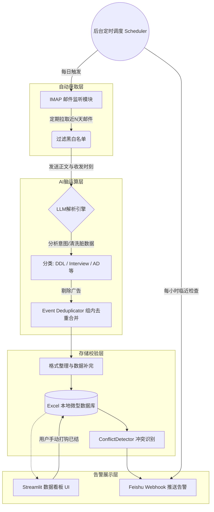

# 🎓 CampusAI - 智能校招邮件管理系统 V3.0

CampusAI 是一款专为高校毕业生和求职者打造的 **自动化校招邮件聚合、解析与管理助手**。
系统通过无缝接入 IMAP 协议监控你的求职邮箱，配合强大的大语言模型 (LLM) 引擎，能自动将杂乱无章的招聘邮件（如笔试邀请、面试通知、测评链接、感谢信等）提炼为结构化的日程待办，并支持自动去重、冲突检测以及飞书消息多端推送。让你在秋招/春招的兵荒马乱中绝不错过每一个重要 DDL！

---

## ✨ 核心特性

- 🤖 **大模型深度解析 (LLM Parser)**
  基于 DeepSeek / OpenAI 接口，精确理解几十种网申平台的邮件模板，不仅能抽取关键信息，更能**智能分辨**个人专属任务(笔试/面试)与群发广告(宣讲/竞赛邀请)，精准拦截冗余信息干扰！
- 📅 **智能排期与冲突检测 (Conflict Detector)**
  自动处理复杂的全天/定点时间，并计算待办重合情况。如果你收到两个时间重合的面试邀请，系统将率先发出冲突预警。
- 🔄 **三层去重防护 (Deduplication)**
  （协议层 Message-ID -> 规则层相似度匹配 -> LLM 语义判断），避免因 HR 取消重发或多封提醒邮件造成的日程重复轰炸。
- 🔔 **飞书全天候推送 (Feishu Integration)**
  提供每次扫描的完成总览，支持对临近 24 小时和 2 小时的 DDL 发送批量告警提醒卡片，让你不在电脑旁也能运筹帷幄。
- 📊 **Streamlit 沉浸式数据看板 (Dashboard)**
  提供清单模式（支持已完成/待办勾选同步本地）、时间轴打点（Timeline）、日历视图以及漏斗洞察，一切求职进展均可通过图表直观掌握！
- 🕰️ **系统级免打扰运行 (Tray Service + Scheduler)**
  集成后台托盘模式与后台定时器（APScheduler），轻松实现每日自动扫描以及每小时巡检预警。

---

## 🏗️ 系统架构



---

## 🛠️ 安装与部署指南

### 1. 环境准备
- 操作系统：Windows (针对 Tray 托盘服务做过优化，Mac/Linux 可能需关闭部分托盘特性)
- Python版本：>= 3.9
- 确保有可用的 API Key (如 DeepSeek, OpenAI) 以及对应邮箱的 IMAP 授权码。

### 2. 克隆与依赖安装
```bash
git clone https://github.com/your-repo/CampusMail-AI-Assistant.git
cd CampusMail-AI-Assistant

# 建议使用虚拟环境
python -m venv .venv
.\.venv\Scripts\activate

# 安装依赖
pip install -r requirements.txt
```

### 3. 配置启动
系统的所有配置可以在 Streamlit 界面上进行可视化编辑，**无需手动修改代码**：
```bash
python dashboard.py
# 或使用快捷脚本
python run_app.py 
```
在浏览器自动打开的页面左侧，依次填入：
1. **邮箱配置**：你的邮箱账号和 **IMAP 专属授权码** (非登录密码)。
2. **AI 模型配置**：填入 Base URL 和对应厂商的 API Key。系统支持一键拉取验证连通性！
3. **飞书通知**：填入飞书机器人 Webhook 地址（选填，为了移动端告警强烈建议配置）。
4. **代理配置**：如果使用海外 OpenAI 接口必须填写系统科学上网代理；如果是 DeepSeek，可关闭该选项。

保存后，点击控制面板底部的 `▶️ 启动` 即可开始初次扫描体验！

---

## 🏃 进阶运行(后台托盘模式)

如果你希望校招季让程序自动安静地守护在后台，无需开启终端黑窗口，请进入主目录执行：
```bash
python tray_service.py
```
这会在你 Windows 桌面右下角生成一个 `📧` 图标。通过右键菜单你可以快速：
- **手动立即运行扫描**
- **查看下次定时扫描时间**
- **一键打开 Web Dashboard 面板**
- 开启/关闭系统自启

---

## 💡 开发与参与贡献
欢迎各类求职者或开发者提交 PR 和 Issues 完善功能，例如加入解析特定公司的刁钻模板，或是优化日历交互。

*声明：本项目绝不会收集、上传您的任何私人简历与邮件内容到任何非必要的海外大模型或服务器外，您的所有数据均只保存在本地 `campus_data.xlsx` 中。*
